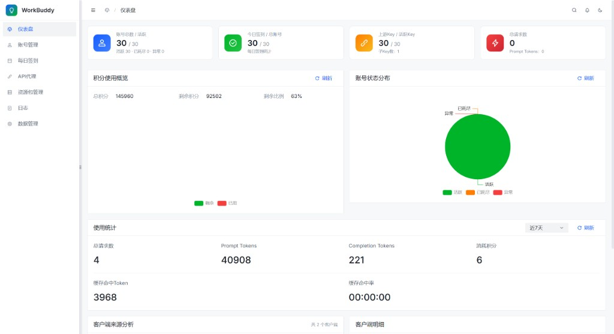
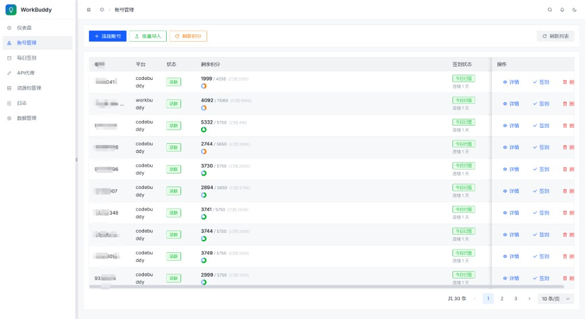
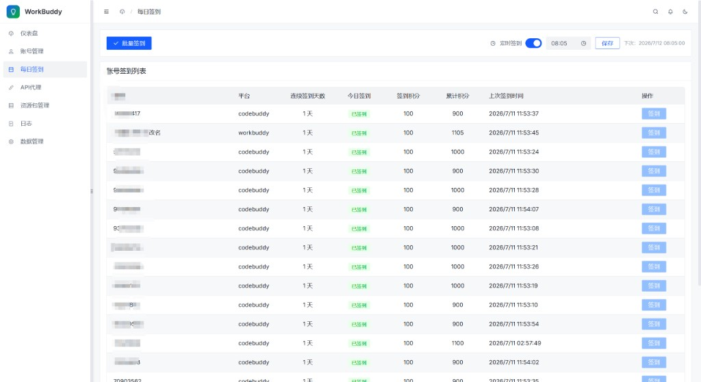
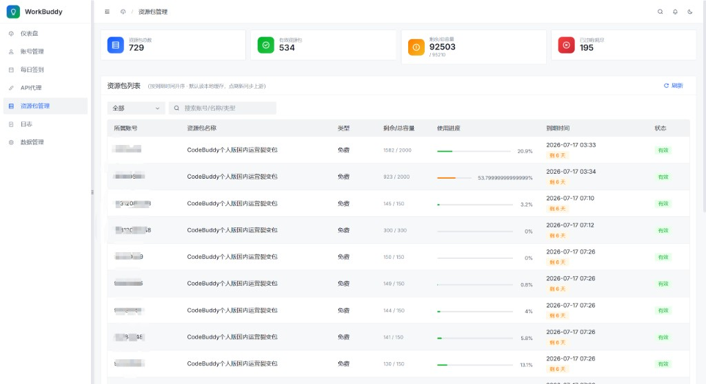
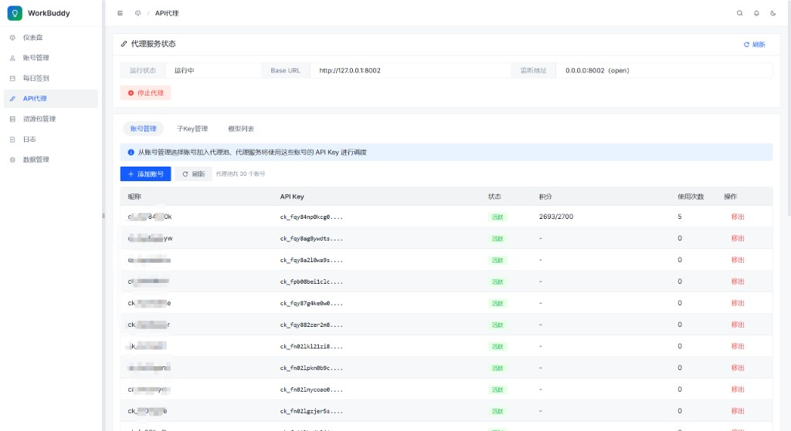
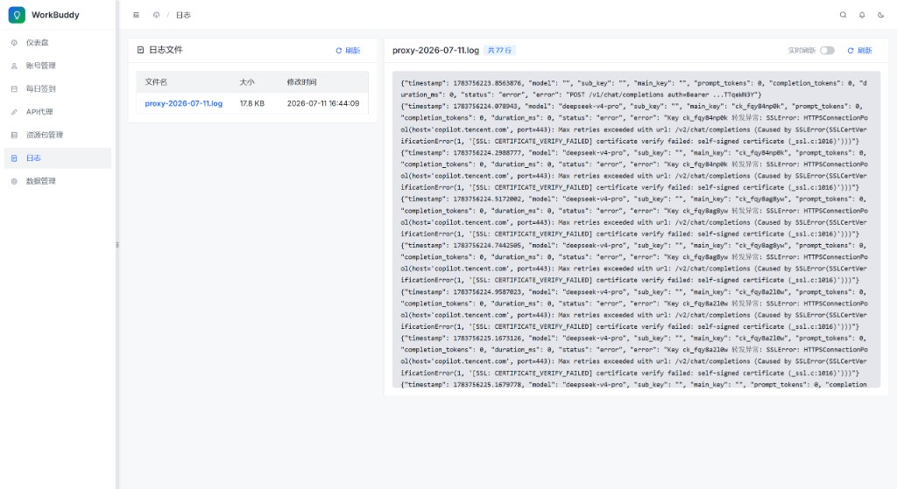

# workbuddy-tool

腾讯 **CodeBuddy / WorkBuddy** 多账号管理面板：签到、资源包、积分看板，以及本地 **OpenAI 兼容 API 代理**。

账号与设置持久化在 **MySQL**；代理 Key 落在本地数据卷。管理端 Vue 3 + Arco Design，后端 FastAPI。

## 功能预览

### 仪表盘

账号状态、签到进度、积分总览与近 7 日用量统计。



### 账号管理

批量导入 `ck_` API Key，查看剩余积分、签到状态，支持单账号签到与刷新。



### 每日签到

批量签到、可配置定时签到（下次执行时间热更新）、连续天数与积分记录。



### 资源包管理

按账号汇总资源包有效/过期状态、剩余容量与到期提醒（MySQL 缓存，避免反复打上游）。



### API 代理

本地统一入口（默认 `:8002`），从账号池调度上游 Key；支持子 Key、模型列表。



### 日志

按日浏览代理请求日志，支持实时刷新与结构化字段查看。



### 数据管理

MySQL 导入/导出加密数据包（WBDP）、旧版 SQLite / `data.enc` 迁移、一键清空。详见下方「数据包格式」与迁移脚本。

## 快速开始（空库 + 导入数据包）

```bash
cp .env.example .env
# Windows PowerShell:
Copy-Item .env.example .env

docker compose up -d --build
```

打开 http://localhost:8000 → **数据管理** → 导入 `.enc` 数据包。

或用脚本：

```bash
# Git Bash / WSL
./scripts/local_up.sh
./scripts/import_package.sh ./your-backup.enc

# 或直接 CLI（需已配置 DB_CONF）
python scripts/package_cli.py import -i ./your-backup.enc
```

默认开发口令见 `.env.example` 中 `DATA_PACKAGE_PASSWORD`，**开源/部署前务必改掉**。

## 配置（敏感信息勿入库）

| 变量 | 说明 |
|------|------|
| `DB_CONF` | MySQL JSON：`host/port/user/passwd/database/charset` |
| `DB_CONF_FILE` / `backend/.db_conf.json` | 本地文件方式（已 gitignore） |
| `DATA_PACKAGE_PASSWORD` | 跨环境导出/导入口令 |
| `BASIC_AUTH_PASSWORD` | 管理端 Basic Auth；空则关闭 |
| `OUTBOUND_PROXY` | 可选出站代理 |
| `HTTP_SSL_VERIFY` | `false` 时跳过 TLS 校验（仅特殊网络） |

生产凭据用 Secret / `.env` 注入，**不要**提交：

- `.env`、`backend/.db_conf.json`、`backend/.docker.env`
- `*.enc`、`*.db`、`proxy_db.json`、`secret.key`
- `backups/`、mysqldump 产物

## 数据包格式

- **v3（推荐）**：口令派生 Fernet（包头 `WBDP`），可跨机器、空库导入
- **旧版**：本机 `secret.key` 加密的 `.enc`，仅同机可解
- **遗留**：SQLite `.db` 可通过「导入 SQLite」写入 MySQL

导出内容：MySQL `accounts` + `settings` + 代理 upstream/sub keys。

旧版桌面端目录 `~/.antigravity-tools` 可迁移：

```bash
python scripts/migrate_legacy_data.py --import-http --replace
```

## 常用脚本

| 脚本 | 作用 |
|------|------|
| `scripts/local_up.sh` | 生成 `.env` 并 `compose up` |
| `scripts/export_package.sh` | HTTP 导出 `.enc` |
| `scripts/import_package.sh` | HTTP 导入 `.enc` |
| `scripts/package_cli.py` | 不经 HTTP，直连 MySQL 导出/导入 |
| `scripts/migrate_legacy_data.py` | 旧版 `data.enc` / SQLite → MySQL |
| `scripts/mysql_dump.sh` / `mysql_restore.sh` | 可选原生 SQL 备份 |

## 开发（不用 Docker 跑前端）

```bash
# MySQL 可用 compose 只起库：
docker compose up -d mysql

# backend/.db_conf.json 示例（勿提交）：
# {"host":"127.0.0.1","port":3306,"user":"workbuddy","passwd":"workbuddy_pass","database":"antigravity","charset":"utf8mb4"}

cd backend && pip install -r requirements.txt
uvicorn main:app --host 0.0.0.0 --port 8000

cd frontend && npm ci && npm run dev
```

## K8s

见 `deploy/k8s.yaml`（镜像 / 域名已换成占位符）。`workbuddy-db-conf` / `workbuddy-basic-auth` 需集群内单独创建 Secret，清单内不含明文密码。CI 默认仅 `workflow_dispatch`，凭据走 GitHub Secrets / Variables。

## License

按仓库 LICENSE 为准；贡献或 fork 前请自查无账号 Token、API Key、数据库地址进入 Git 历史。
